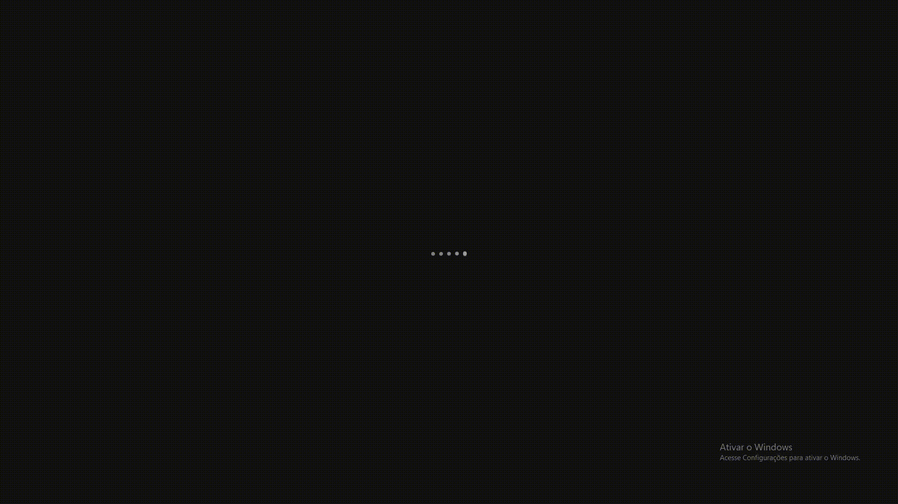

Projeto <strong>Sound bar loading animation</strong> 👾

---

## 👾 Sobre o Discord: 

O Discord é um aplicativo de VoIP gratuito, projetado para criar comunidades que variam de jogadores a educação e negócios. O Discord é especializado em comunicação de texto, imagem, vídeo e áudio entre usuários em um canal de bate-papo. 

---

</img>

---

## :memo: Licença

Esse projeto está sob a licença MIT. Veja o arquivo [LICENSE](LICENSE.md) para mais detalhes.